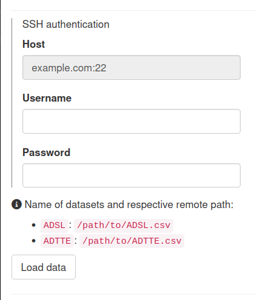

# `teal.connectors.ssh`: `teal` connector to access data via SSH

<!-- start badges -->
[](https://insightsengineering.github.io/teal.connectors.ssh/main/unit-test-report/)
[](https://insightsengineering.github.io/teal.connectors.ssh/)
[](https://insightsengineering.github.io/teal.connectors.ssh/main/coverage-report/)


[](https://www.repostatus.org/#active)
[](https://github.com/insightsengineering/teal/tree/main)
[](https://github.com/insightsengineering/teal/issues?q=is%3Aissue+is%3Aopen+sort%3Aupdated-desc)
<!-- end badges -->


This package allows SSH data to be pulled into `teal` applications.
The app developer can use this as a [`teal_data_module`](https://insightsengineering.github.io/teal/latest-tag/data-as-shiny-module.Rmd) in their `teal` application.

`teal.connectors.ssh` allows the app developer to define:

- One or more paths to the data in the remote server
- The data names that will be associated with the data
- Function to use to read the data. Defaults to `utils::read.csv`
  - Extra arguments on `ssh_connector` call will be passed on to this function 
- _(optionally)_ The host of the remote server
  - If not defined, the user must input it manually

For an example as to how this works see the example app in the help page: `help(ssh_connector)`.

## Installation

```r
install.packages("teal.connectors.ssh", repos = c("https://insightsengineering.r-universe.dev", getOption("repos"))))

# install.packages("pak")
pak::pak("insightsengineering/teal.connectors.ssh@*release")
```

Alternatively, you might also use the development version.

```r
install.packages("teal.connectors.ssh", repos = c("https://pharmaverse.r-universe.dev", getOption("repos")))

# install.packages("pak")
pak::pak("insightsengineering/teal.connectors.ssh")
```

## Example

```r
library(teal.connectors.ssh)
x <- ssh_connector(
  paths = list(ADSL = "/path/to/ADSL.csv", ADTTE = "/path/to/ADTTE.csv"),
  host = "example.com:22"
)
app <- teal::init(data = x, modules = list(teal::example_module()))
shiny::runApp(app)
```


>>>>>>> 0f60c45 (initial commit)
